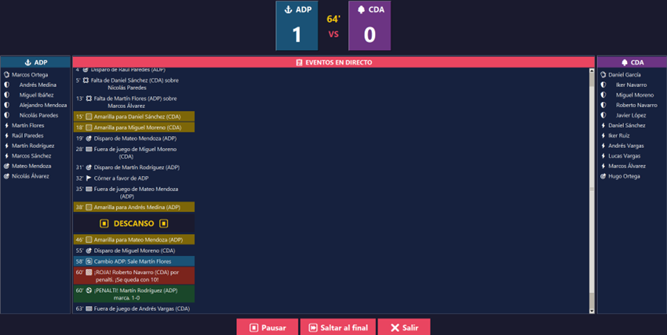
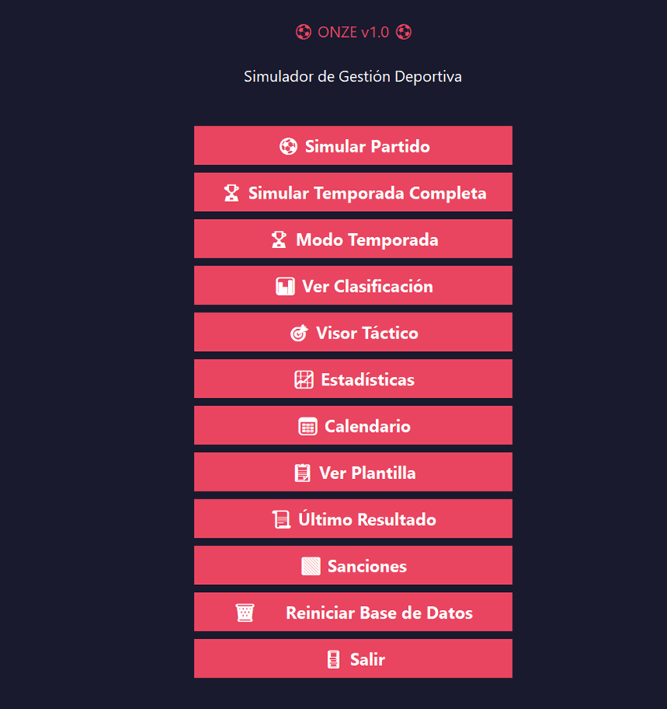
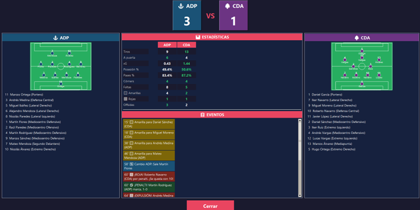
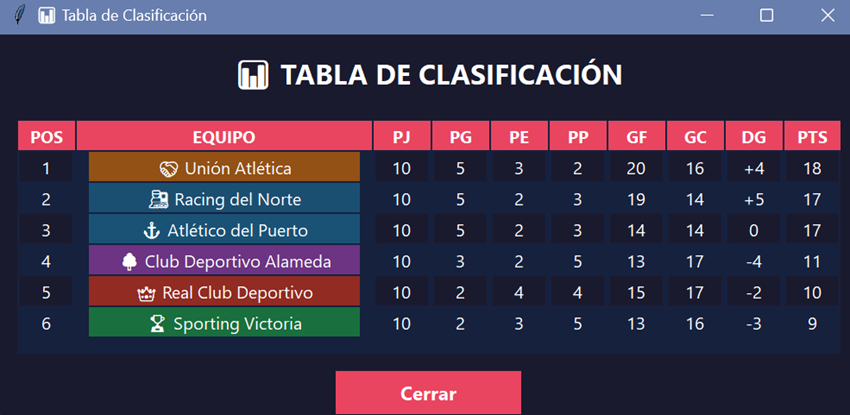
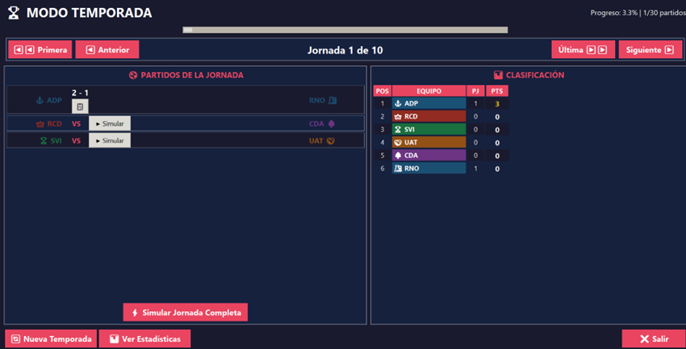
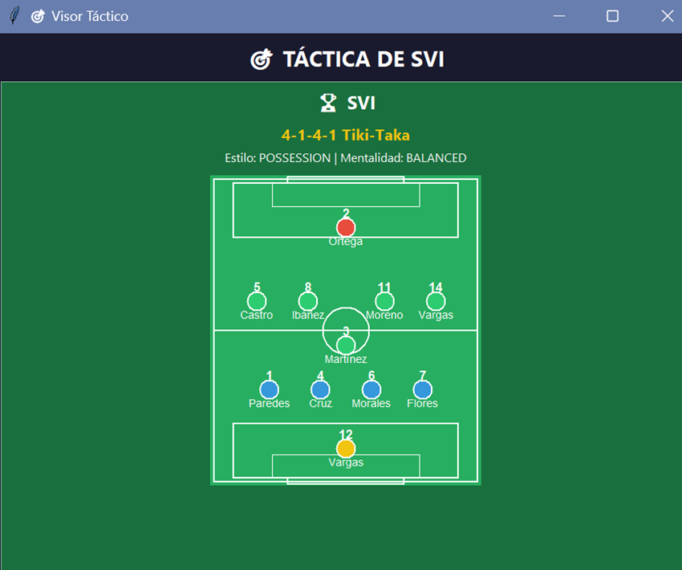

# ⚽ Onze - Simulador de Fútbol Manager

<p align="center">
  
</p>

<p align="center">
  <strong>Simulador de gestión futbolística desarrollado en Python, Tkinter y SQLite.</strong>
</p>


**Onze** es un simulador de gestión de fútbol desarrollado en Python con interfaz gráfica Tkinter. Permite simular partidos en tiempo real, gestionar una liga completa con 6 equipos, visualizar estadísticas detalladas y disfrutar de una experiencia inmersiva minuto a minuto.

---

## 🎮 Características

### ⚽ Simulación de Partidos en Vivo
- Partidos minuto a minuto con narración en tiempo real
- Eventos detallados: goles, penaltis, tarjetas, lesiones, sustituciones
- Marcador en directo con actualización automática
- Descanso a los 45' y tiempo de descuento

### 🏆 Modo Temporada
- Liga completa con 6 equipos (ida y vuelta = 10 jornadas)
- Calendario navegable jornada a jornada
- Simulación de jornada completa o partido individual
- Clasificación actualizada en tiempo real
- Barra de progreso de la temporada

### 📊 Estadísticas Avanzadas
- Tiros, tiros a puerta, posesión, córners, faltas
- xG (Goles Esperados) y precisión de pases
- Máximos goleadores y récords de temporada
- Estadísticas comparativas entre equipos

### 🟥 Sistema Disciplinario
- Tarjetas amarillas y rojas con impacto real en el partido
- Expulsiones por doble amarilla o roja directa
- Sanciones por acumulación de tarjetas
- Penaltis con narración y tarjeta al infractor

### 🎨 Interfaz Visual
- Diseño moderno con colores personalizados por equipo
- Visualización táctica de formaciones (4-4-2, 4-3-3, etc.)
- Mini-campo con jugadores posicionados
- Pestañas con eventos, estadísticas y alineaciones

### 🩹 Lesiones
- Sistema de lesiones con 3 niveles de gravedad
- Narrativa visual: 🤕 leve, 🚑 moderada, 🏥 grave

---

## 🛠️ Tecnologías

- **Python 3.14**: Lógica del juego y simulación
- **Tkinter**: Interfaz gráfica de usuario
- **SQLite3**: Base de datos local
- **Threading**: Simulación en tiempo real con hilos
- **POO**: Arquitectura orientada a objetos

---

## 📁 Estructura del Proyecto

```text
onze/
├── capturas/
│   ├── menu.png
│   ├── partido.png
│   ├── resultado.png
│   ├── clasificacion.png
│   ├── temporada.png
│   └── tactico.png
├── database/
│   ├── init_database.py
│   └── updates/
│       └── run_all_updates.py
├── simulation/
│   ├── match_simulator.py
│   ├── live_match.py
│   ├── league_simulator.py
│   ├── season_manager.py
│   └── tactics.py
├── gui_main.py
├── utils.py
├── team_colors.py
├── main.py
├── clean_db.py
└── README.md
```

## 🚀 Instalación y Ejecución

### Requisitos

- Python 3.8 o superior
- No requiere instalación de paquetes adicionales (Tkinter y SQLite vienen incluidos)

### 1. Clona el repositorio

```bash
git clone https://github.com/Anelido70/onze.git
cd onze
```

### 2. Inicializa la base de datos

```bash
python database/init_database.py
python database/updates/run_all_updates.py
```

### 3. Ejecuta el juego

```bash
python gui_main.py
```

## 📸 Capturas de Pantalla

| Menú Principal | Partido en Vivo |
|----------------|----------------|
|  |  |

| Resultado | Clasificación |
|------------|---------------|
|  |  |

| Temporada | Visor Táctico |
|-----------|---------------|
|  |  |

👤 Autor
Víctor Fernández García
📚 Estudiante de 1º DAW (Desarrollo de Aplicaciones Web)
🔗 GitHub: Anelido70
💼 LinkedIn: www.linkedin.com/in/víctor-fernández-24b5b9253
